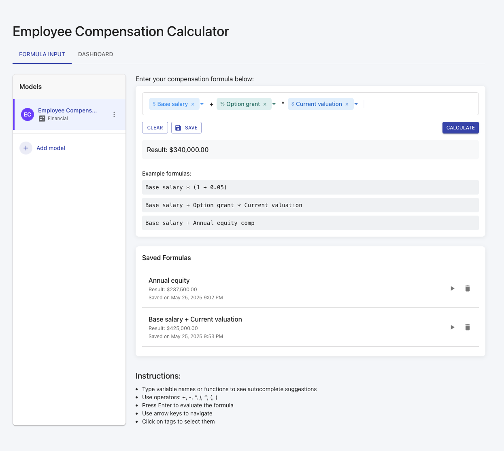
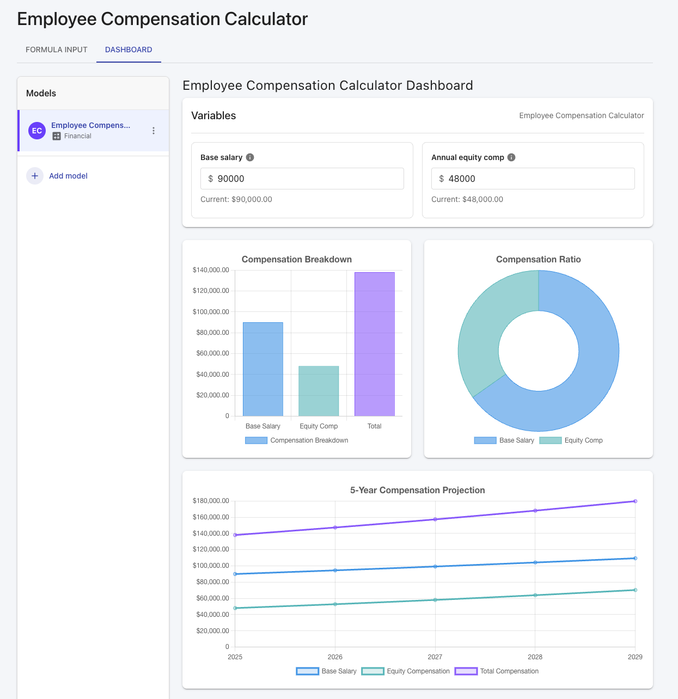

# Formula Input Component

A React application that implements simple formula input functionality. This application allows users to create formulas with variables, functions, and operators, and provides visualization tools for financial analysis.

## Screenshots

### Formula Input


### Dashboard


## Features

- Interactive formula input with rich editing capabilities:
  - Support for operands between tags (+, -, *, /, ^, (, ))
  - Support for natural numbers and decimal values
  - Variable tags with auto-complete suggestions
  - Deleting tags with backspace
  - Intuitive cursor navigation

- Multiple model types with dedicated dashboards:
  - Compensation Calculator
  - Equity Analysis
  - Performance Metrics

- Dynamic visualization:
  - Bar charts for value comparison
  - Pie/doughnut charts for distribution analysis
  - Line charts for time-based projections

- Editable variable values with persistence
- Formula evaluation with mathjs
- Professional UI with responsive design
- Saved formulas with localStorage persistence

## Technologies Used

- React 18 with TypeScript
- Vite for fast development
- Zustand for state management
- React Query for API state management
- Material UI for UI components
- Chart.js with react-chartjs-2 for data visualization
- mathjs for formula evaluation

## Getting Started

### Prerequisites

- Node.js (v16 or higher)
- npm

### Installation

1. Clone the repository
2. Install dependencies:

```bash
npm install
```

3. Start the development server:

```bash
npm run dev
```

4. Open your browser and navigate to `http://localhost:5173`

## Usage

1. Select a model type from the sidebar
2. Edit variable values in the dashboard to customize your analysis
3. Use the formula input to create custom calculations:
   - Click on the formula input field
   - Start typing to see autocomplete suggestions
   - Select a suggestion to add it as a tag
   - Use operators (+, -, *, /, ^, (, )) between tags
   - Press Enter to evaluate the formula
4. Save formulas for future use
5. View different visualizations on the Dashboard tab

## Project Structure

- `src/store/formulaStore.ts` - Zustand store for managing application state
- `src/hooks/useAutocomplete.ts` - React Query hook for autocomplete suggestions
- `src/components/FormulaInput.tsx` - Main formula input component
- `src/components/FormulaTag.tsx` - Component for rendering formula tags
- `src/components/Suggestions.tsx` - Component for rendering autocomplete suggestions
- `src/components/LinkedModels.tsx` - Sidebar component for model selection
- `src/components/VariableEditor.tsx` - Component for editing variable values
- `src/components/Dashboard.tsx` - Data visualization dashboard
- `src/components/SavedFormulas.tsx` - Component for managing saved formulas

